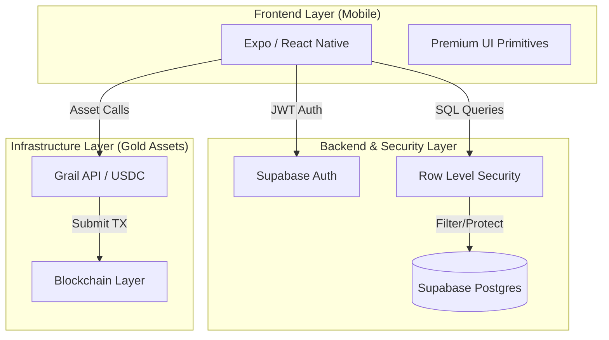

# 🏗️ Architectural Overview - Vàng Heo Đất

This document outlines the high-level system design and data flow of the Vàng Heo Đất application.

---

## 🗺️ System Map

The application follows a **Decentralized 3-Tier Architecture**, decoupling the user experience from the complex gold asset management.

---

## 🚀 Component Description

### 1. Frontend Layer

- **Tech Stack**: Expo SDK 52, React Native 0.76.
- **Interactions**: Powered by `react-native-reanimated` and `expo-haptics` for tactile feedback.
- **Routing**: Expo Router (File-based) providing web-like navigation consistency.

### 2. Backend & Security Layer

- **Supabase**: Handles real-time state synchronization and user profiles.
- **RLS (Row Level Security)**: Critical Senior-grade security measure ensuring users can ONLY access their own piggies and transactions at the database level.
- **Auth**: Social-first providers with session persistence via `SecureStore`.

### 3. Infrastructure Layer

- **Grail API**: Acts as the bridge between the digital piggy bank and physical gold assets.
- **USDC**: Used as the primary liquid asset for purchasing gold targets, ensuring instant settlement.

---

## 📈 Core Data Flows

### Create Piggy Flow

1. User defines name and target in **App**.
2. **App** inserts record into `piggies` table in **Supabase**.
3. **RLS** validates ownership based on JWT.
4. **Supabase** triggers record creation in `piggy_balances` (Balance initialization).

### Gold Transaction Flow

1. User submits buy request.
2. **App** calls **Grail API** with USDC reference.
3. **Grail** confirms transaction and updates **Blockchain**.
4. **App** reflects update via **Supabase** real-time listeners.
