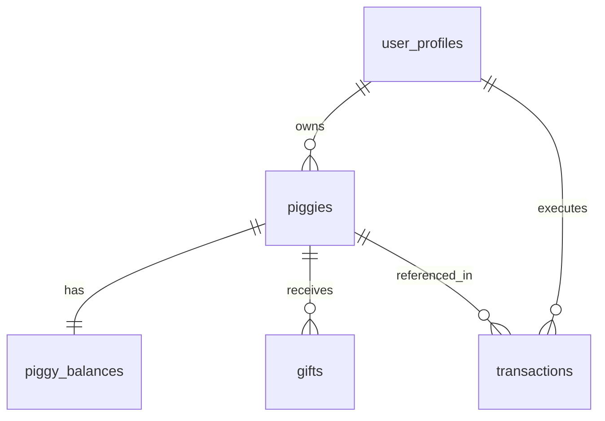

# 📊 Database Schema Specification - Vàng Heo Đất

This document provides a detailed technical specification of the Supabase (PostgreSQL) database layer.

---

## 🗺️ Entity Relationship Overview

The schema is designed for high relational integrity and atomic transactions.

---

## 📂 Core Tables

### 1. `user_profiles`

Stores extended user data beyond Supabase Auth.

- `id`: UUID (Primary Key, matches Auth User ID).
- `display_name`: String (Optional).
- `grail_usdc_balance`: Decimal (Last synced balance).
- `onboarding_completed`: Boolean.
- `grail_deposit_address`: String (Used for inbound transfers).

### 2. `piggies`

The core entity representing a child's virtual gold target.

- `id`: UUID (Primary Key).
- `user_id`: UUID (Foreign Key -> user_profiles).
- `child_name`: String.
- `avatar_url`: String (Emoji or Asset link).
- `target_amount`: Decimal (Optional gold target).

### 3. `piggy_balances`

- `piggy_id`: UUID (Primary Key, Foreign Key -> piggies).
- `gold_amount`: Decimal (Current gold holdings).
- `grail_wallet_id`: String (Reference to Grail infrastructure).

### 4. `transactions`

Historical record of all fund movements.

- `id`: UUID (Primary Key).
- `user_id`: UUID (Foreign Key -> user_profiles).
- `piggy_id`: UUID (Optional, Foreign Key -> piggies).
- `type`: Enum (`buy_gold`, `gift_sent`, `gift_received`).
- `status`: Enum (`pending`, `completed`, `failed`).
- `amount`: Decimal (Gold amount).

---

## 🔐 Row Level Security (RLS) Policies

Every table in the `public` schema has RLS enabled to enforce the **Principle of Least Privilege**.

| Table            | Policy Name                              | Logic                                                             |
| ---------------- | ---------------------------------------- | ----------------------------------------------------------------- |
| `user_profiles`  | `Users can view own profile`             | `auth.uid() = id`                                                 |
| `piggies`        | `Users can manage own piggies`           | `auth.uid() = user_id`                                            |
| `piggy_balances` | `Users can view balances of own piggies` | `piggy_id IN (SELECT id FROM piggies WHERE user_id = auth.uid())` |
| `transactions`   | `Users can view own transactions`        | `auth.uid() = user_id`                                            |

---

## 📌 Maintenance Notes

- **Indexes**: Primary indexes are automatically created for UUID keys.
- **Triggers**: Ensure `user_profiles` are created automatically via a Supabase trigger on the `auth.users` table.
